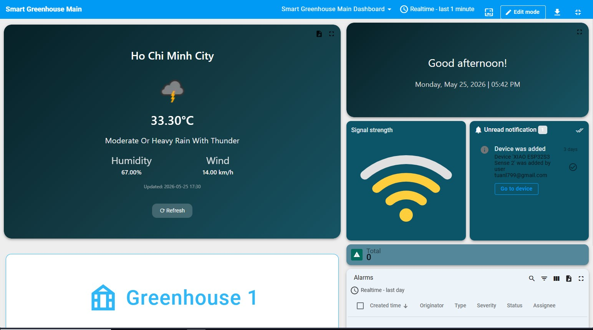
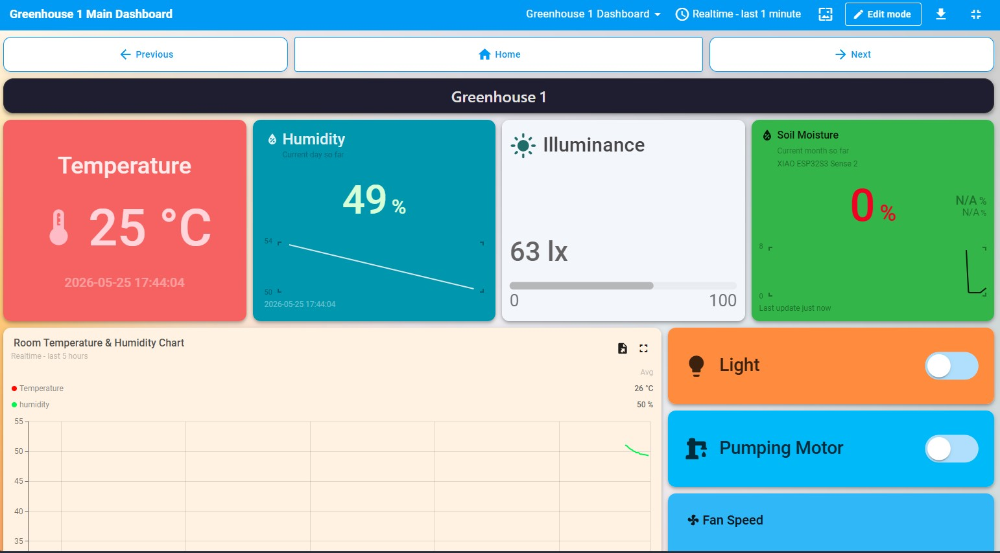
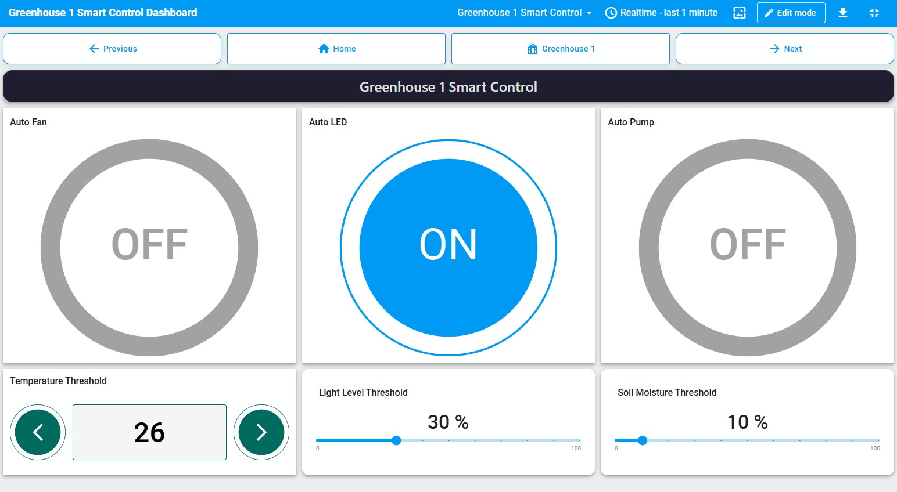

# Smart Greenhouse IoT Controller


A FreeRTOS-based embedded IoT controller for automated greenhouse monitoring and actuator management. Built on the Seeed Studio XIAO ESP32-S3 Sense, this project utilizes a robust event-driven architecture to monitor environmental sensors and safely control physical actuators (fans, water pumps, and lighting).

This project focuses heavily on **thread-safe concurrency**, **memory management**, and **advanced power efficiency**.

---

## Key Features

* **Real-Time OS Architecture:** Utilizes FreeRTOS Queue Sets and Mutexes to seamlessly manage concurrent sensor polling, I2C display updates, and MQTT cloud syncing without data loss or race conditions.
* **Edge-Computing Rule Engine:** Implements local control logic that evaluates sensor data (temperature, moisture, light) against configured thresholds. Ensures critical hardware (pumps and fans) operates safely and autonomously even during Wi-Fi outages.
* **Multi-Layered Power Management:** Drastically extends battery life by combining:
    * **FreeRTOS Tickless Idle:** Automatically shuts down CPU cores when tasks are blocked.
    * **Wi-Fi Modem Sleep:** Synchronizes the 2.4GHz radio antenna with router beacons.
    * **Peripheral Timeouts:** Custom software timers to disable the I2C LCD backlight after user inactivity.
    * **Hardware Interrupts:** Uses `gpio_wakeup_enable` to keep the CPU asleep until a physical button is pressed.
* **Cloud Integration:** Connects to the CoreIOT/ThingsBoard platform via MQTT for real-time telemetry visualization and remote RPC control of actuators.

---

## Remote Monitoring and Controlling Through IoT Dashboard

### Main Dashboard


### Greenhouse 1 Dashboard


### Greenhouse 1 Smart Control Dashboard


---

## Hardware Requirements

* **Microcontroller:** Seeed Studio XIAO ESP32-S3 Sense
* **Sensors:** * DHT20 (Temperature & Humidity)
    * Analog Soil Moisture Sensor
    * Analog Light Sensor
* **Actuators:**
    * Mini Fan (PWM control)
    * Water Pumping Motor (Relay driven)
    * RGB LED (PWM control)
* **UI/Peripherals:**
    * 16x2 I2C LCD Display
    * Push Button (for manual screen wake/toggles)

---

## Software Architecture

The firmware is divided into highly decoupled, specialized FreeRTOS tasks:

* `wifi_task`: Event-driven state machine managing connection and Modem Sleep (replaces standard polling loops).
* `vSensorsTask`: Periodically polls the DHT20, Soil, and Light sensors, executes the local rule engine, and pushes data/commands to queues.
* `vActuatorTask`: A stateless executor that blindly applies hardware states received from the actuator queue.
* `vSendTelemetryTask`: Syncs queued sensor data and actuator confirmations to the ThingsBoard server via MQTT, protected by Mutexes to prevent network timeouts.
* `vLcdTask`: Manages the local UI state machine. Implements a placeholder initialization pattern and an interaction timeout to disable the I2C backlight and save power.
* `vButtonTask`: Handles hardware interrupts for single/double clicks to navigate local menus.

---

## Setup & Installation

1.  **Clone the repository:**
    ```bash
    git clone https://github.com/yourusername/smart-greenhouse-iot.git
    ```
2.  **Open in PlatformIO:**
    Open the project folder using VS Code with the PlatformIO extension installed.
3.  **Configure Credentials:**
    Create a `secrets.h` file in the `include/` directory and add your Wi-Fi and MQTT credentials:
    ```cpp
    #ifndef SECRETS_H
    #define SECRETS_H

    #define DEFAULT_SSID_HOME "Your_WiFi_SSID"
    #define DEFAULT_PASSWORD_HOME "Your_WiFi_Password"
    #define COREIOT_TOKEN "Your_Device_Token"

    #endif
    ```
4.  **Build and Upload:**
    Compile the code and flash it to the XIAO ESP32-S3.
---

## License
This project is licensed under the MIT License.